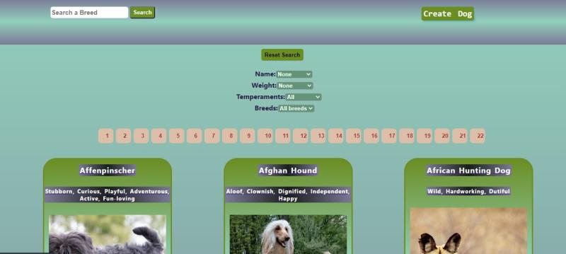
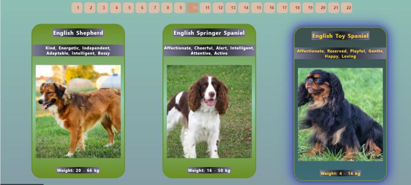
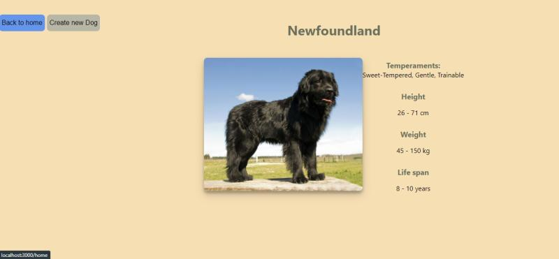

# Hi there, I´m Juan Manuel Grehuello, Full Stack Developer from Argentina👋

### I studied hospitality but tech industry has always been my real passion

🔭 I’m currently working on a grupal proyect for Henry bootcamp, an E-commerce for snikers!  
🌱 I’m currently learning TypeScript  
👯 I’m looking to collaborate on huge companies around the world  
⚡ Fun fact: I love playing basketball and football with my friends  

### Languages and Tools:

[]
[]
[]
[]
[]
[]
[]
[]
[]
[]
[]

 

## My Individual Proyect for Henry Bootcamp
👇

🚀 Technologies: 
React - Redux - Sequelize - NodeJS - Express - PostgreSQL - CSS pure - HTML5 - JS

### Connect with me:

&nbsp;&nbsp;

&nbsp;&nbsp;

&nbsp;&nbsp;

 
 